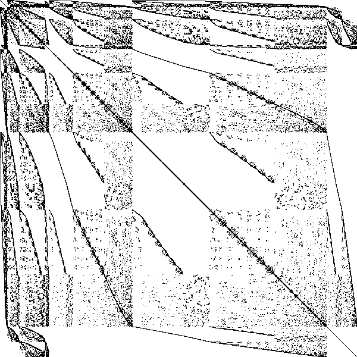
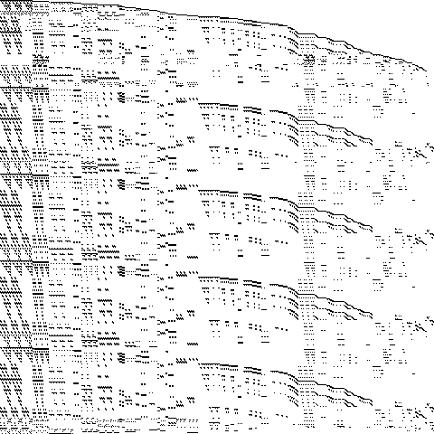

## Usage

Convert [sparse matrix market](https://math.nist.gov/MatrixMarket/formats.html#MMformat) files to images.

<p align="center">
 
</p>

`mtx2img <input-path> <output-path> [-w <output-image-width>] [-h <output-image-height>] [-c <colormap-name>]`

Required arguments:
- `<input-path>`: path pointing to an existing MatrixMarket file (*.mtx* or *.mm*). It must use the *coordinate* format (i.e.: represent a sparse matrix). Alternatively, `-` can be passed to read the same format from *stdin* instead of a file.
- `<output-path>`: the output image will be written here. If a file already exists, it will be overwritten. If the path exists but is not a file, the program will without touching the output path.

Optional arguments:
- `[-w <output-image-width>]`: width of the output image in pixels. This setting is overridden if the number of rows in the input matrix is less than the provided width. The default value is 1080.
- `[-h <output-image-height>]`: height of the output image in pixels. This setting is overridden if the number of columns in the input matrix is less than the provided height. The default value is 1080.
- `[-c <colormap-name>]`: name of the colormap to apply on pixels. The options are limited to `binary` (default) or `kindlmann`. If the matrix dimensions are larger than the output image dimensions, multiple nonzeros may end up getting mapped to the same pixel. The program sums up the number of nonzeros that reference each pixel, and normalizes this "*nonzero density*" after reading the matrix. The `-c` option controls how these densities are mapped to RGB colors in the output image.
   - `binary`: any pixel with at least one nonzero mapping to it is black; the rest are white.
   - [`kindlmann`](https://www.kennethmoreland.com/color-advice/#extended-kindlmann) (extended)
   - [`viridis`](https://www.kennethmoreland.com/color-advice/#viridis)

## Installation

### Precompiled binary

Precompiled binaries are available from the "Release" section of the repository.

*Recently built binaries are also accessible as artifacts of GitHub CI runs.*

### Build from source

Requirements:
- git (or just download the source manually)
- a C++20 compiler (touchy subject I know ... make sure it supports `std::format` and `ranges`)
- CMake >= 3.15.0 [optional]

```bash
git clone https://github.com/matekelemen/mtx2img.git
```

You have 3 options to build the project. These are, in descending order of preference:
1) using CMake. For example:
```bash
cmake -H<path-to-repo> -B<path-to-build-dir> -DCMAKE_INSTALL_PREFIX=<path-to-install-dir>
cmake --build <path-to-build-dir> --target install --config Release
```
2) using the provided `makefile` (expects `g++`):
```bash
cd <path-to-repo-root>
make
```
3) using the `build.sh` shell script (disclaimer: it's meant for development and uses CMake internally):
```bash
<path_to_repo_root>/build.sh -t Release -i <path-to-install-dir>
```
